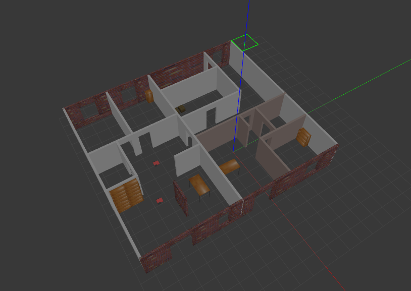

# Build my world
A first project from Udacity Robotics Nanodegree. 
Main tasks:
* Build single floor structure in Gazebo
* Model simple robot (with joints)
* Import a least one model from Gazebo Online Library
* **Write C++ plugin** to display "Welcome to my World" message

<p align="center">
  
  <br>A single floor world created in Gazebo
</p>


## How to use
* Get and compile the code
```sh
mkdir path_to_project
cd path_to_project
git init
git remote add origin url_of_thi_project
git pull
git checkout master
mkdir build
cd build/
cmake ../
make
export GAZEBO_PLUGIN_PATH=${GAZEBO_PLUGIN_PATH}:`pwd`
```
* Run the code:
```sh
cd path_to_project/world
gazebo my_world
```

## License
The contents of this repository are covered under the [MIT License](./LICENSE.txt)


## Contributing

1. Fork it (<https://github.com/michLab/project_1_build_my_world.git>)
2. Create your feature branch (`git checkout -b feature/fooBar`)
3. Commit your changes (`git commit -am 'Add some fooBar'`)
4. Push to the branch (`git push origin feature/fooBar`)
5. Create a new Pull Request


